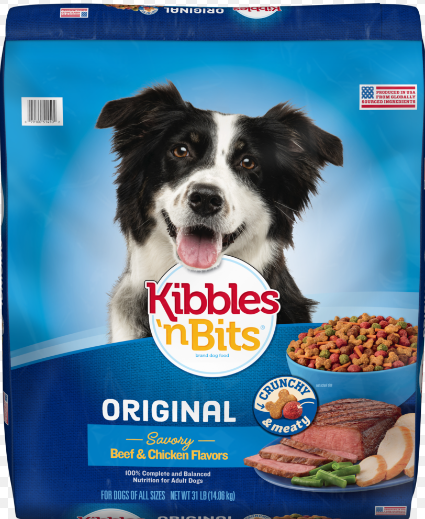

# Roast my code: Data dumping in AiiDA


<details>
  <summary>A little fun fact about:</summary>

  

  It's got 60g / 100g of protein!!! 💪

  That's why today's GM will be all about dogfooding 🐶

</details>

<details>
  <summary>So let's get started!</summary>


</details>

## Dumping collection data

Let's first run with the defaults and see where we get:

```shell
verdi storage dump --path /home/geiger_j/aiida_projects/verdi-profile-dump/dev-dumps/storage-mirror/ -o
```

Next, let's check all the CLI options and their default values:

```shell
verdi storage dump -h
```

Some things to consider:
- `--path`: This is the global parent path for dumping. All different collections/entities will be dumped into specific
  subdirectories based on the locally modified `output_path` variable.
- `--overwrite`: Currently same setting applies to the parent directory, which will be cleaned in that case (in
  principle, the argument is passed also to the individual `Dumper`s; see below)
- `--incremental`: Don't delete directories that already exist, as to gradually update the directory as data is added to
  the profile/storage
- `dry-run`: Just a dry-run of the dumping: This currently only generates the directories, but doesn't give much other
  useful information -> Still gotta improve implementation here
- `--organize_by_groups` (`True` by default)
    - If not set, only top-level `calculations`, `workflows`, and `data` are created in the dumping directory, and organization in groups is ignored.
    - If set, entities that are in a certain group `group` will be put in this directory in a nested structure based on
      the group's `type_string` and label
- `--dump-processes/--dump-data`: Dump `ProcessNode`s and `orm.Data` nodes; both `True` by default. In principle
  `orm.Data` nodes of the profile are implicitly contained in the dumped process data. If `--dump-data` is  `True`, also
  a structured dedicated `Data` directory is created. If specified, either one of `--also-raw` (`False` by default) or
  `--also-rich` (`True` by default) must also be set
- `--only-top-level-workflows`: With this diabled, also sub-workchains will be dumped into their respective directories.
  Otherwise only top-level workchains (this is the default).
- `--calculations-hidden/--data-hidden`: `True` by default. If set, `CalcJob` data and `orm.Data` entities will be
  dumped in a hidden directory using their UUIDs and symlink from the structured output directories (this can aid in
  avoiding duplication of data)
- `--include-inputs`, `--include-outputs`, `--include-attriutes`, `--include-extras`: These are options from the
  `ProcessDumper`, to also dump linked input nodes and output nodes for each `CalcJob`, as well as if the `ProcessNode`
  attributes and extras should be dumped to the `.aiida_node_metadata.yaml` file in every `ProcessNode`s directory.
- `--flat`: This is also from the `ProcessDumper`, and, if activated, removes the `inputs`, `outputs`, `node_inputs` and
  `node_outputs` subdirectories for each `CalcJob`s directory (not sure how relevant this is for actual use cases, so it
  might be something that will be removed... backwards incompatibility, as it is already released?)
- `--dump-config-file`: Specify all settings for the dumping via a config file in YAML format:
  ```shell
  verdi storage dump --config /home/geiger_j/aiida_projects/verdi-profile-dump/git-repos/aiida-core.worktrees/feature/verdi-profile-dump/src/aiida/tools/dumping/test-config-file.yaml
  ```
- `--nodes` and `--groups` allows selecting only specific nodes or groups to be dumped. This is similar to the interface
  of `verdi archive create`, which also allows specifying `--codes/-X` and `--computers/-Y`, however, for simplicity, I
  did not add those two, as the user can just specify the codes via `--nodes` and export the `Computer`s manually
  (`--nodes` doesn't accept `Computer`s via their UUID; PKs are anyway different.)

## `raw` and `rich` data dumping

- `raw` data dumping just dumps the `attributes` of every `orm.Data` node
  - This is currently hard-coded such tat the resulting YAML files are always contained in the associated `CalcJob`
    directories, as I don't see it very valuable to have individual structured `data` directories that contain the
    `Node` attributes -> low-priority TODO
- `rich` data dumping dumps `orm.Data` nodes in a "nice" format to disk. This can be a `cif` of `orm.Structuredata`
  and `orm.TrajectoryData`, or a `pdf`/`png` of `orm.BandsData`.
    - A default export mapping for core data types is given by `DEFAULT_CORE_EXPORT_MAPPING`
    - This can be overridden either by the `--rich-spec` command-line option, using a string like:
      ```shell
      --rich-spec='core.array.bands:<custom-exporter>:format=mpl_png,core.structure::format=xsf'
      ```
      where the first entry is the entry point of the `orm.Data` type, the second option is the exporter (which could be
      either a valid registered entry point, a Python function, etc. -> This still needs to be implemented), and the last
      entry is the export file format
  - The `spec` for the rich data dumping can also be provided in the `--config` YAML file
  - When the `--rich-dump-all` flag is set, and a `spec` to specify the `rich` dumping of certain `orm.Data` data
    types is provided, the remaining ones are dumped with the default settings, as given in the
    `DEFAULT_CORE_EXPORT_MAPPING`. If this flag is `False` _only_ the selected data types as given in the `spec` are
    dumped in the `rich` format. With `--no-dump-processes` this would allow the user to, e.g. only dump all band
    structure data nodes in the profile, but nothing else.

## Some sources of complexity/extra logic

- Much of the logic comes from setting the output paths, filenames, and export options properly for the various different options, as well as ensuring
  that data is not duplicated, and different organization schemes within a profile are handled<br>
  &rarr; FOR THIS, PLEASE TRY OUT THE FEATURE AND GET BACK TO ME WITH REQUESTS, BUGS, UNEXPECTED BEHAVIOR, ETC., AS I CANNOT COVER ALL USE CASES
- Avoiding sub-workflows being dumped in their own dedicated directories, as that convolutes the directory structure
- Avoiding duplicate dumping of calculations called by a workflow that is in a Group: If a workflow is part of a group,
  its called calculations would be dumped, both, in the designated directory, as well as the top-level `calculations`
  directory, as the `CalculationNode`s are not inherently part of `Group.nodes`, leading to data duplication. Thus, when
  obtaining all profile nodes which are _not_ parts of groups, by diffing them with the nodes that _are_ parts of
  groups, to obtain the list of the latter, also the `called_descendants` of each `WorkflowNode` have to be included.

## Design questions

- Currently, three `Dumper` classes are defined: `ProcessDumper`, `DataDumper`, and `CollectionDumper`
- <details>
    <summary>Initially, I had also had an `AbstractDumper` that defined all the options but it made encapsulation a bit tricky and
    I, by times, didn't end up with the right settings in the right places</summary>

  

  </details>
- We have a rather lengthly list of arguments from the CLI/config file that need to be passed through and assigned at the right
  places. Currently, I compile them in dictionaries, corresponding to the property they relate to (this is not really
  necessary, one could also directly assign the values, but I just found it to help a bit with the code organization;
  might be removed once everything is somewhat stable).
- Now, the `ProcessDumper` has a `data_dumper` attribute to link a `DataDumper` instance to it, while the `CollectionDumper`
  has both `process_dumper` and `data_dumper` attributes
- In `cmd_storage`, the `DataDumper` and `ProcessDumper` are instantiated and passed to the `CollectionDumper` (as well
  as the `DataDumper` assigned to the `ProcessDumper`), to ensure the instances are available where required with the
  correct options assigned to them. The options of the `CollectionDumper` depend on the node
  collection that is supposed to be dumped, so different instances are created in the `storage_dump` function.
- The `DataDumper` has a singledispatched `dump_core_data_node_rich` method with a default implementation, and custom
  implementations for data types, where the implementation differs for certain types (e.g. `StructureData`, `BandsData`, `Code`,
  `Computer`). These provide mainly some pre-processing, and, by default, the `data_export` function is always called that uses one of the `_prepare_*` methods of the
  derived `orm.Data` class. Default exporters and export formats are defined in the `DEFAULT_CORE_EXPORT_MAPPING`

## Dumping processes (you should all be familiar with this now already!)

- `raw`/`rich` data dumping of assocated `Data` nodes is now implemented at this level
- I'm also working on retrieving remote data (if still existing on the remote `Computer`); a first PoC works ([this PR](https://github.com/aiidateam/aiida-core/pull/6578)), but needs some improvements, e.g. allowing for file globbing/exclusion, checking the total size beforehand (as this might be
  large)

## Known TODOs

- [ ] Rich dumping of plugin data types by automatically determining the entry points, and (possibly) passing custom
  dumping functionality (via entry points, python files that contain the required code, etc.)
  - This was a bit hindered by the
  fact that the two trial Data types I wanted to use for development `quantumespresso.hubbard_structure` and
  `pseudo.upf` don't implement `_prepare_*` methods, so the default dumping via `data_export` did not work
  - Thus, if plugin data types are supposed to be dumped, they either need to conform to this standard in AiiDA, or the
    user must specify custom exporters (passing those is not implemented yet)
- [ ] Selecting only certain `orm.Data` types to be dumped (this is somewhat already possible by the `rich` specification)
- [ ] Allow mixing of config file and command-line options? Should additional command line options overwrite settings in config file?
    - Or, just ignore additional command-line options, and use the defaults, if values are not set in the file?
- [ ] More fine-grained `overwrite`?
  - Possibly also passing it via specification, resulting `overwrite__calculations`,
  `overwrite__data`, etc.
  - Currently, it's just a global `overwrite` option for the whole folder, making the initial initial implementation
    easier
- [ ] As data dumping can take a while for large collections of data, add a progress bar (@Ali, the man of the progress bar
  PRs 🚀)
- [ ] Improve dry-run to provide more information about the data that would be dumped
- [ ] Dump `Computer` setup and config files (these are currently not written to disk, even though they should be;
  probably still a bug)
- [ ] Dump additional possibly useful information, e.g. `config.json` of the profile
- [ ] How to handle import groups? Right now they should also always be dumped. Could provide another option to the CLI
- [ ] Add `verdi group dump` -> This should be easy, as I already have the code in `cmd_storage.py`, just need to copy over
  to `cmd_group.py`
- [ ] Dump `raw` data nodes in the central `data` directory
